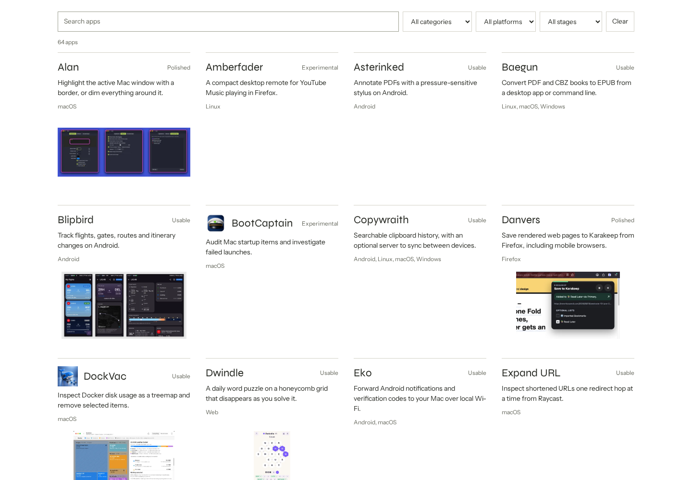

# apps-site

> [!IMPORTANT]
> LLM disclosure: This codebase was written with substantial help from large language models: AI coding agents working from the [`AGENTS.md`](AGENTS.md) brief in this repo.

**Version:** v<!-- version -->0.1.0<!-- /version --> · [Releases](https://github.com/L-K-M/apps-site/releases)

Generate an app directory from JSON files. The output is HTML, CSS, a small search script,
and images. Upload it to any static web server.



Headings use self-hosted Syne; text uses self-hosted Instrument Sans. Both fonts
are bundled under SIL OFL 1.1. [Sources and licenses](public/fonts/README.md).

## Run

Requires Node 22.14+ and npm. Git is optional; it supplies source links from repo origins.

```sh
cd ~/workspace/apps-site
npm ci
npm run build
npm run preview
```

Open <http://127.0.0.1:4173>. The generated site is in `dist/`.

The starter catalogue contains 64 apps, covering the public L-K-M app repositories
and the existing web-only entries. [Repository audit](docs/catalogue-inventory.md).
Maturity includes author-stated ratings and documented best-effort estimates. Edit
`catalogue/*.json` to assess them or change the selection. Screenshot snapshots are
credited in [`catalogue/assets/README.md`](catalogue/assets/README.md).

## Add an app

Put **`app-directory.json` in the app repo's root**:

```json
{
  "$schema": "https://raw.githubusercontent.com/L-K-M/apps-site/main/schema/app-directory.schema.json",
  "schemaVersion": 1,
  "apps": [
    {
      "id": "my-app",
      "status": "visible",
      "name": "My App",
      "summary": "A clipboard manager with searchable history.",
      "category": "Utilities",
      "maturity": "usable",
      "platforms": ["macos", "linux"],
      "screenshots": [
        { "src": "docs/screenshot.png", "alt": "Clipboard history with a search field" }
      ],
      "links": { "download": "https://github.com/you/my-app/releases/latest" }
    }
  ]
}
```

Then run `npm run build`. The default configuration discovers manifests in sibling
repos. Repos are read locally; the generator does not fetch, clone, pull, or execute them.
Update the source repos before rebuilding when needed.

[`examples/single-app.json`](examples/single-app.json) includes all common fields.
Replace its placeholders and screenshot path before using it.

### Monorepos

Use several entries in the same `apps` array, each with a globally unique `id`.
Set `path` to that app's directory, such as `apps/reader`. Platform inference and local
image paths are relative to this directory. Omit `path` for the repo root.

A manifest-level `repository` URL supplies the shared source link. Without one, a local
Git origin is used when available. Individual `links.source` values override it.
See [`examples/monorepo.json`](examples/monorepo.json).

Hauntware's Séance, Poltergeist and Planchette share `catalogue/hauntware.json`.
[`examples/hauntware.json`](examples/hauntware.json) has their actual imported app
paths and is ready to adopt as the monorepo's root `app-directory.json`. Once
adopted, those entries replace their central counterparts by id.

### Web-only apps

Put a manifest in `catalogue/`. Supply `platforms: ["web"]` and `links.website`.
A repo and download link are optional. See [`examples/web-app.json`](examples/web-app.json).
Central catalogues can also describe apps whose repos are elsewhere.

### Metadata

Set `"status": "hidden"` on an app to stop publishing it. Set it back to
`"visible"` to show it; omitted status defaults to visible. Rebuild with
`npm run build`, or `docker compose run --rm generator` in Compose, to apply
the change. Hidden apps have no generated listing, detail page, search entry,
count, sitemap entry, exported JSON or app-specific media. A rebuild removes
previously published pages and media.

`status` controls publication; `maturity` remains the experimental/usable/polished
label beside the app's name. In a monorepo, each app has its own status. Repo-local
entries take precedence over central entries, including their visibility.

| Field | Meaning |
|---|---|
| `id` | Stable lowercase URL slug, e.g. `wordwarp` |
| `status` | `visible` or `hidden`; defaults to `visible` |
| `name`, `summary`, `category` | Required display text; summary is limited to 240 characters |
| `description` | Optional plain text; blank lines separate paragraphs |
| `maturity` | `experimental`, `usable`, or `polished`; omitted means “Not assessed” |
| `maturityNote` | Explanation of the supplied maturity assessment |
| `platforms` | `macos`, `windows`, `linux`, `android`, `ios`, `web`, `firefox`, `chrome`, `pebble`, `rg-nano` |
| `path` | App directory relative to the manifest; default `.` |
| `tags`, `features` | Search keywords and a list of features |
| `icon` | Image object with `src` and `alt` |
| `screenshots` | Image objects with `src`, `alt`, and optional `caption` |
| `links` | Optional `website`, `download`, `source`, and `docs` URLs |

Local PNG, JPEG, WebP, GIF, AVIF and SVG images are copied into the output with
content-hashed filenames. Raster screenshots get small WebP directory previews; detail
pages keep the original images. Local paths must stay inside the app directory, including
through symlinks. HTTP(S) image URLs remain external references; use local files for a
self-contained site. Links are supplied by the author, not fabricated from repo names.

Maturity is an editable assessment:

- **Experimental:** early version; expect rough edges and changing behaviour.
- **Usable:** works for its intended purpose; some rough edges remain.
- **Polished:** refined for regular use, with attention to details.

The starter catalogue estimates missing ratings from documented core workflows,
known limitations, install/build paths and maintenance history. Estimated ratings
are marked `Estimated:` in `maturityNote`; they are not hands-on certification.
Existing author-stated assessments are retained. A version number or a release
alone does not establish maturity. Adjust the JSON ratings as you use the apps.

Omit `platforms` to infer them from explicit npm `os` declarations, Swift/Xcode settings,
Android application manifests, specific Tauri bundle targets, or Flutter platform entry
files. Inference is conservative and identified on the detail page. Generic Tauri `all`,
Dockerfiles, bare directory names and embedded web frontends do not establish support.
An explicit list always wins; `[]` deliberately means no platforms specified. Central
catalogue entries do not run repo inference; supply their platform lists explicitly.

## Sources and configuration

Edit [`site.json`](site.json):

- `repositoryRoots`: repo directories or workspace directories containing repos.
  Discovery checks each root and its immediate child directories for `app-directory.json`.
- `catalogues`: manifest files or directories; directories collect `.json` files recursively.
  Keep schemas and unrelated JSON outside these directories.
- `output`: destination, default `dist`.
- `title`, `description`, `author`, `authorUrl`: site identity and metadata.
- `url`: optional public URL, including a deployment subpath. Enables canonical URLs and
  `sitemap.xml`, e.g. `https://example.org/apps/`.

Paths are relative to the configuration file. All configured sources must exist.
Repo-local entries replace central entries with the same `id`. Duplicates within either
tier are errors. Remove a central seed after adoption if you do not want it to reappear
when its repo-local entry is removed.

```sh
npm run validate
npm run build -- --repos /other/workspace
npm run build -- --config my-site.json --output public
```

Schemas reject unknown properties and unsupported values with the filename and field.
Builds are deterministic. A rebuild removes obsolete generated pages and media. Invalid
metadata or missing images leave the last successful output intact. Existing nonempty
directories are replaced only if they contain this generator's ownership marker.
Concurrent builds use a heartbeat lease. After a killed build, retry after 30 seconds;
the expired lease is reclaimed, including in a persistent Compose volume.

The HTML catalogue and app pages work without JavaScript. Search and filters are
progressive enhancements, with shareable query URLs. All internal links are relative,
so the site can be hosted under a subdirectory. `apps.json` exports the normalized public
catalogue without local source paths.

## Deploy

### Static hosting

```sh
npm run build
rsync -av --delete dist/ you@host:/var/www/apps/
```

Serve that directory with ordinary index-file handling. No Node process, database or
external font service is required on the host.

### Docker Compose

```sh
docker compose up -d --build
```

Open <http://localhost:8080>. A one-shot generator reads the catalogue and mounted repos,
then nginx serves the generated files from a shared volume. Refresh metadata and images:

```sh
docker compose run --rm generator
```

For code updates, `./update.sh` pulls main, refreshes base images, rebuilds and regenerates.
Compose options:

| Variable | Default | Meaning |
|---|---|---|
| `APPS_SITE_PORT` | `8080` | Published HTTP port |
| `REPOSITORIES_DIR` | `..` | Host repo/workspace directory, mounted read-only |
| `SITE_CONFIG` | `./docker/site.json` | Generator configuration, mounted read-only |

Container configuration uses `/repositories` for the mounted repos and `/app/catalogue`
for the central catalogue. Keep `output` at `/site/public`, which is nginx's document root.
Changes to central JSON need regeneration; changes to generator code need an image rebuild.

## Checks and releases

```sh
npm ci
npx playwright install --with-deps chromium
make check
```

This runs lint, unit/integration tests, generation, and desktop/mobile browser tests.
The browser fixture is hosted under a subpath and also exercises JavaScript-disabled
browsing. CI additionally starts the Compose stack and checks its HTTP response.

`scripts/build.sh` installs dependencies and runs generator checks. To release, install
[`lkm-release`](https://github.com/L-K-M/release-tool), then run
`scripts/release.sh X.Y.Z [--push]`. Tags run checks and publish a static-site archive.
